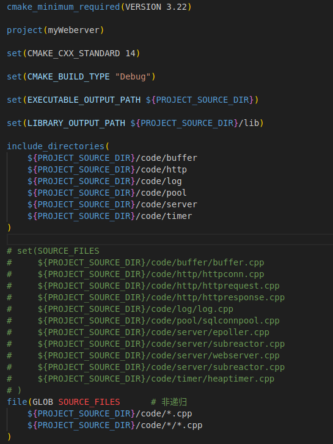
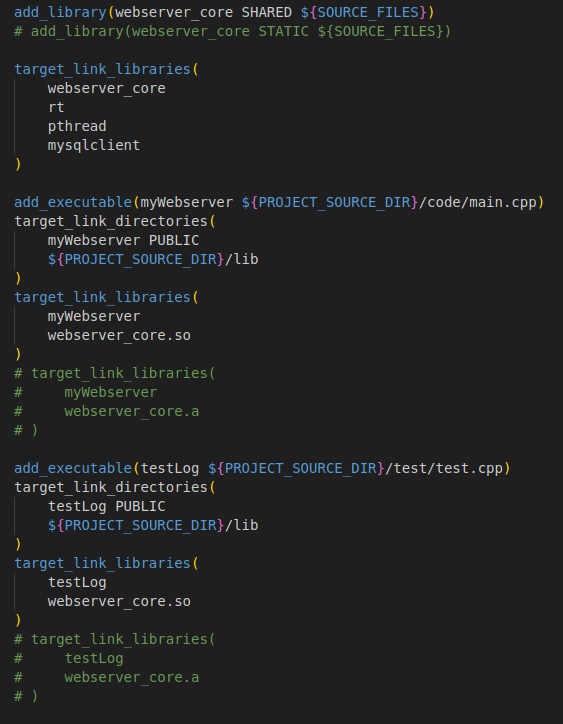

# Total 
**如果同时1000个客户端进行访问请求，线程数不多，怎么能及时响应处理每一个呢？**
该项目是基于IO复用的并发模式。当客户连接有事件需要处理的时，epoll会进行事件提醒，然后将其对应的任务加入请求队列，等待工作线程竞争执行。如果速度还是慢，那就只能够增大线程池容量，或者考虑集群分布式的做法。

**常用的定时器结构和它们的差异？**
除了小根堆实现之外，还有使用时间轮和基于升序链表实现的定时器结构。

基于升序链表实现的定时器结构按照超时时间作为升序做排序，每个结点都链接到下一个结点，由于链表的有序性以及不支持随机访问的特性，每次插入定时器都需要遍历寻找合适的位置，而且每次定时器调整超时时间时也需要往后遍历寻找合适的位置进行挪动，遍历操作效率较低。

小根堆实现的定时器结构，每次取堆头都是最短超时时间，能够利用IO复用的超时选项，每次的计时间隔动态调整为最短超时时间，确保每次调用IO复用系统调用返回时都至少有一个定时事件的超时发生或者监听事件的到达，有效地减少了多余的计时中断（利用信号中断进行计时）。最主要是确保每次定时器插入、更新、删除都能实现稳定的logn时间复杂度。

**最终采用小根堆，调整小根堆占比3-4%，O(logn)**

**日志系统的实现需要考虑什么？
线程安全性还有效率问题。**

首先是线程安全方面，日志系统需要记录多个连接运行的情况，也就是说日志系统被多个线程拥有，这个时候需要考虑线程安全的问题，通过内部关键操作（涉及临界区资源的部分）进行加锁，实现每个线程对日志对象的访问不会产生冲突，避免日志写入的混乱。

另一个方面的话是效率问题，为了实现线程安全人为地加锁，而日志系统又需要进行IO操作，这样会导致线程持锁阻塞其他线程对锁地争用，同时大量地IO读写也会使当前调用日志对象的线程被阻塞在IO操作上，颠倒了事件处理优先级的顺序。效率这一块可以通过采用异步线程加双缓冲区写入的方式优化，调用日志对象的线程只需要完成两次内存拷贝，通过空间换时间的手法【双缓冲区是为了缓解内存读写速度和磁盘读写速度的差异导致部分数据丢失】，将磁盘IO操作交给单独的线程去处理，这样调用日志对象的线程能够保证尽可能地持锁时间短而且不会阻塞在IO操作上。

**Reactor和Proactor的区别？**
Reactor采用的是同步IO，多路复用监听事件，对于到达的事件根据类型进行任务分发，交给线程池处理。换个说法就是他感知到的是读，然后需要应用进程主动调用 read方法来完成数据的读取，也就是要应用进程主动将 socket 接收缓存中的数据读到应用进程内存中，这个过程是同步的，读取完数据后应用进程才能处理数据。

Proactor采用的是异步IO，只负责发起IO操作，真正的IO实现由操作系统处理。然后任务池从指定的缓冲区中取出数据进行操作，只考虑逻辑处理不需要处理IO操作。换个说法就是他感知到的是已经完成的读写事件。这里的读写工作全程由操作系统来做，并不需要像 Reactor 那样还需要应用进程主动发起 read/write 来读写数据，操作系统完成读写工作后，就会通知应用进程直接处理数据。

**同步I/O和异步I/O的区别**
同步IO和异步IO的区别主要在于获取数据的方式不同。或者说将数据从内核复制到用户空间时，用户进程是否会阻塞。

同步IO是内核通知用户可以进行读写操作，需要用户手动使用函数进行系统调用陷入内核，将内核数据拷贝到用户缓冲区。

而异步IO则是通过系统调用向内核发起通知，告知要进行的IO操作并指明存放的缓冲区，当内核完成IO操作时再通知用户（通常是回调函数实现），此时用户得到的是已经准备好的数据，没有中间阻塞的IO操作。

**为什么采用Reactor？**
Proactor模式是针对异步I/O设计的，而Linux上没有相关的异步I/O系统调用，只能通过主线程进行同步I/O进行模拟，实现的意义不大，所以便直接采用了Reactor模型。

**有什么优化方案？**
采用多Reactor模型，主线程只负责新连接到达的监听以及新连接的建立，对于新到达的连接通过生产者消费者模型分发给子Reactor（另起线程），由子Reactor完成已建立连接的读写事件监听任务。这样当有瞬间的高并发连接时，也不会出现新连接丢失的情况。

**I/O多路复用**
1. select、poll、epoll的区别
当有事件触发时，select和poll需要用户自己去遍历文件描述符找出触发的事件，而epoll能够直接返回所有的触发事件；
2. 每次调用select和poll都需要将文件描述符集合拷贝到内核空间，返回时再拷贝一次。而epoll只需要拷贝需要修改的文件描述符而不需要集体的拷贝；
3. select支持的文件描述符数量有上限（1024），而poll和epoll没有此限制；
4. select、poll 和 epoll 底层数据结构实现各不相同。select 使用数组；poll 采用链表；epoll 底层使用的是红黑树，能够有效的提升效率。
5. select和poll都只能工作在相对低效的LT模式下，而epoll同时支持LT和ET模式。

**epoll为什么高效？**
相对于select，epoll能够监听的文件描述符没有上限；poll和select一样，每次调用都要将文件描述符集合在内核和用户之间进行拷贝；每次由事件触发的时候，需要遍历所有文件描述符找到触发的事件；**而epoll只需要往内核空间里的红黑树添加修改或者删除指定的文件描述符和事件，不需要每次都拷贝所有的文件描述符集合到内核当中去，同时也能够直接返回就绪事件，无需重复遍历文件描述符集合。**

所以在需要监听多个文件描述符上的事件的时候，选用epoll更有效率，内核直接返回触发事件。**但是当需要监听的文件描述符数量少且较为活跃的情况下，select和poll相比epoll更有效率，因为其省去了触发感兴趣事件时的函数回调操作（将数据从红黑树上添加到就绪链表中）。**

**ET、LT模式的区别**
LT模式：即水平触发模式，只要内核缓冲区还有数据就会提醒（哪怕已经提醒过，针对同一事件可以多次提醒）
ET模式：即边沿触发模式，每一次事件到来只通知一次（针对一个事件只提醒一次而不是提醒多次），没有及时读取完，该部分剩余数据直到下次触发，才能被读取（有可能永远也读不到，如果没有再次触发文件描述符上的该事件）

**为什么要将监听套接字设置为非阻塞的？clientfd呢？**
先说clientfd：
1. 使用ET模式，需要不断进行读取，而如果无剩余数据时进行读取，如果使用阻塞模式会导致read函数阻塞；使用非阻塞模式函数会立刻返回；
2. epoll上虽然有读写事件返回，但事件因为一写异常，其实不一定可读写，如果使用阻塞IO会导致在调用 read/write 时则会发生程序阻塞，因此最好搭配非阻塞 I/O，以便应对极少数的特殊情况。

**为什么将监听套接字设置为非阻塞？**
1. 性能优化：在使用epoll时，通过将监听套接字设为非阻塞，可以确保服务器在等待客户端连接时，不必在accept()调用上阻塞。这允许服务器立即返回并执行其他任务，从而提高性能。
2. 避免边缘触发模式（Edge Triggered, ET）下的问题：当使用边缘触发模式时，只有在一个连接的状态发生变化时，epoll才会通知这个变化。如果一个监听套接字被设置为阻塞模式，当客户端连接到达时，可能会在处理完一个连接后阻塞。在此期间，如果有另一个客户端尝试连接，而服务器仍然在阻塞等待accept()返回，那么这个新的连接请求可能会被忽略，导致性能下降。
3. 能够处理多个连接：在非阻塞模式下，服务器在处理一个连接时，仍然可以进行其他操作。这样就能够在短时间内接受并处理多个客户端连接请求，提高服务器的并发性能。

其实说白了，和ET模式有关，边缘触发模式下，若设置为阻塞，就会导致我们的函数如read、accept等阻塞，性能降低或错过其他连接套接字等问题。

**HTTP为什么要用状态机？**
有限状态机，是一种抽象的理论模型，它能够把有限个变量描述的状态变化过程，以可构造可验证的方式呈现出来。比如，封闭的有向图。

有限状态机可以通过if-else,switch-case和函数指针来实现，从软件工程的角度看，主要是为了封装逻辑。有限状态机一种逻辑单元内部的一种高效编程方法，在服务器编程中，服务器可以根据不同状态或者消息类型进行相应的处理逻辑，使得程序逻辑清晰易懂。

尽量用make_shared代替new去配合shared_ptr使用，因为如果通过new再传递给shared_ptr，内存是不连续的，会造成内存碎片化

    std::chrono::high_resolution_clock
    duration（一段时间）
    time_point（时间点）
一般获取时间点是通过clock时钟获得的，一共有3个：
    ①、high_resolution_clock
    ②、system_clock
    ③、steady_clock

* high_resolution_clock
他有一个now()方法，可以获取当前时间。注意：std::chrono::high_resolution_clock返回的时间点是按秒为单位的。

* std::chrono::milliseconds表示毫秒，可用于duration<>的模板类，举例：chrono::duration_cast<milliseconds>

**CMake基本操作**

